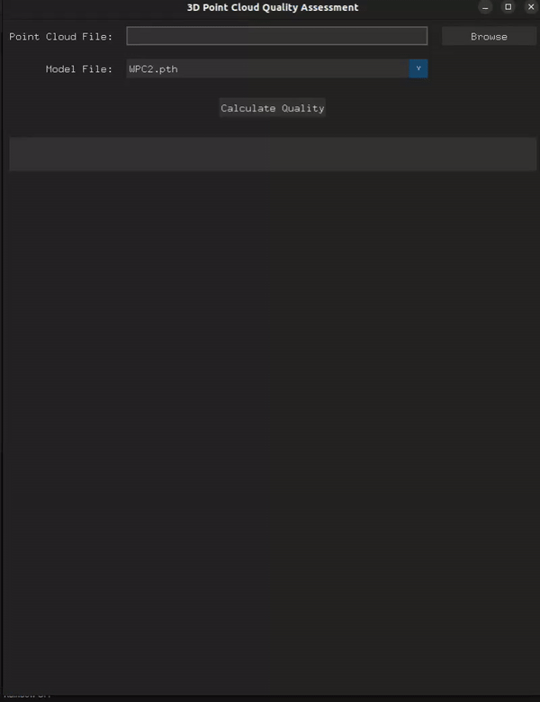

# MHyNet-PC: A Multi-modal Hybrid No-Reference Framework for Point Cloud Quality Assessment

This is the official GitHub repository that refers to the paper MHyNet-PC: A Multi-modal Hybrid No-Reference Framework for Point Cloud Quality Assessment that has been presented at the conference IEEE 13th International Conference on Image Processing Theory, Tools and Applications (IPTA) 2024.

```
J. Chatterjee, M. Creemers, J. Coosemans and M. Torres Vega, "MHyNet-PC: A Multi-modal Hybrid No-Reference Framework for Point Cloud Quality Assessment," 2024 Thirteenth International Conference on Image Processing Theory, Tools and Applications (IPTA), Rabat, Morocco, 2024, pp. 1-6.
```

This github has a main branch, containing all the necessary files to train your own Point Cloud Quality Assessment (PCQA) model, assess the quality of a single point cloud, as well as the necessary files needed to run the PCQA-tool.

## Motivation
The motivation for this work started from the fact that as of today, no efficient No-Reference (NR) Point Cloud Quality Assessement model exsits that is able to accurately predict the quality of a 3D-Point cloud. Because of this, we propose a hybrid multimodal model calles MHyNet-PC that harnesses the benefits from both a Resnet based Deep learning network and a Statistical feature extraction model.

## Framework


Our approach leverages two feature modalities to predict quality metrics. The first being features from the 3D data itself, while the second modality contains features extracted by first projecting a point cloud to a 2D plane. Features are extracted from two modalities using both a 3D Statistical Feature Extraction Model and a 2D Image Feature Extraction Model. These features are then enhanced through mutual guidance using symmetric cross-modal attention (Data Fusion Model), resulting in a final feature representation consisting both of the original and enhanced features. Ultimately, this feature representation is decoded into a single quality prediction throughthe quality regression model.

## Getting Started.
In order to train the model, several components and libraries need to be installed.

First, make sure that the correct Nvidia drivers are installed. We trained the model on linux 22.04 with Nvidia driver-545 with cuda 12.3. These can be downloaded from [here](https://developer.nvidia.com/cuda-12-3-0-download-archive?target_os=Linux&target_arch=x86_64&Distribution=Ubuntu&target_version=22.04&target_type=deb_network). To check wether the correct version is installed, you can run the following command. 
```bash
  nvidia-smi
```
To run the code itself, several packages need to be installed. An overview is given in [requirements.txt](https://github.com/Jit-INP/MHyNetPC-main/blob/main/requirements.txt). Installing all libraries at once can be done by running the following command:

```bash
pip install -r requirements.txt
```
## Model Training
In order to train your own model, the projections of the point clouds from the different datasets need to be downloaded from [here](https://1drv.ms/f/c/fe05f8cee0ae7fd1/EjweUBYenu5PiLDCR7-hLCEBmQiSBKQ-v6Fx2z-d3FwwVA?e=Yx3aSV). The unzipped folder should be put in the folder SJTU/WPC/WPC2.0 depending on the downloaded projections. The following structure should be obtainend

```
SJTU-+-SJTU_MOS.csv
     |
     +-SJTU_NSS.csv
     |
     +-projections-+-hhi_0.ply-+-projection_0.png
                   |...        |...
                   |...        +-projection_5.png
                   |...
                   +-ULB_Unicorn_41.ply+-projection_0.png
                                       |...
                                       +-projection_5.png


```
The reference point clouds aren't provided but can be downloaded/access can be requested from their source.

The natural scene statistics, and their scalers are already be available. After this is added, the parameters of the model can be tweaked in the config.json. The standard configuration is the following where gpu 0 represents the dedicated graphics card on Linux

```json
{
    "gpu": 0,
    "num_epochs": 100,
    "batch_size": 8,
    "learning_rate": 0.001,
    "decay_rate": 0.0001,
    "model": "nss1",
    "projections_dirs" : ["SJTU/projections"],
    "mos_data_paths": ["SJTU/SJTU_MOS.csv"],
    "nss_features_paths" : ["SJTU/SJTU_NSS.csv"],
    "number_of_projections": 6,
    "loss": "l2rank",
    "datasets": ["SJTU"],
    "k_fold_num": 5
}
```

After the wanted parameters are chosen, the model can be trained by running 

```bash
./train.sh
```
The outputs will be saved in a log file that is specified in train.sh, and the best model will be saved in the ckpts folder.

## Using pre-trained models
Pre-trained models can be downloaded here: [pretrained_models](https://1drv.ms/f/c/fe05f8cee0ae7fd1/Ep8kGgx7FgRGlclDxHKcvH8B6MyqMCQXQF01pAAvP7c3uw?e=oyBfhe)

## PCQA Tool
The code also contains a point cloud quality assessment tool. In order to use it, you should add your own model or one of the pretrained models. We recommend using the ones provided in the "tool_models" folder. In the tool you are asked to select a point-cloud, pretrained model, and then you can train train the model. A demo is showed below



# Citation

If you find our work and code helpful, please cite:

```
J. Chatterjee, M. Creemers, J. Coosemans and M. Torres Vega, "MHyNet-PC: A Multi-modal Hybrid No-Reference Framework for Point Cloud Quality Assessment," 2024 Thirteenth International Conference on Image Processing Theory, Tools and Applications (IPTA), Rabat, Morocco, 2024, pp. 1-6.
```

This code repository is based on some other works.

If you find them helpful, please cite:

```
@article{zhang2022mm,
  title={MM-PCQA: Multi-Modal Learning for No-reference Point Cloud Quality Assessment},
  author={Zhang, Zicheng and Sun, Wei and Min, Xiongkuo and Zhou, Quan and He, Jun and Wang, Qiyuan and Zhai, Guangtao},
  journal={IJCAI},
  year={2023}
}

@ARTICLE{zhang2022no,
  author={Zhang, Zicheng and Sun, Wei and Min, Xiongkuo and Wang, Tao and Lu, Wei and Zhai, Guangtao},
  journal={IEEE Transactions on Circuits and Systems for Video Technology}, 
  title={No-Reference Quality Assessment for 3D Colored Point Cloud and Mesh Models}, 
  year={2022},
  volume={},
  number={},
  pages={1-1},
  doi={10.1109/TCSVT.2022.3186894}}
```


